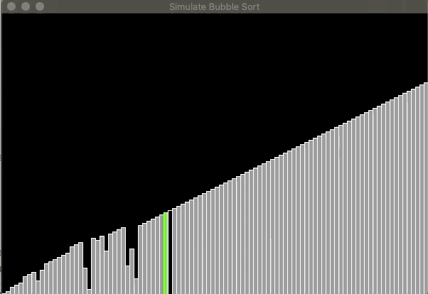
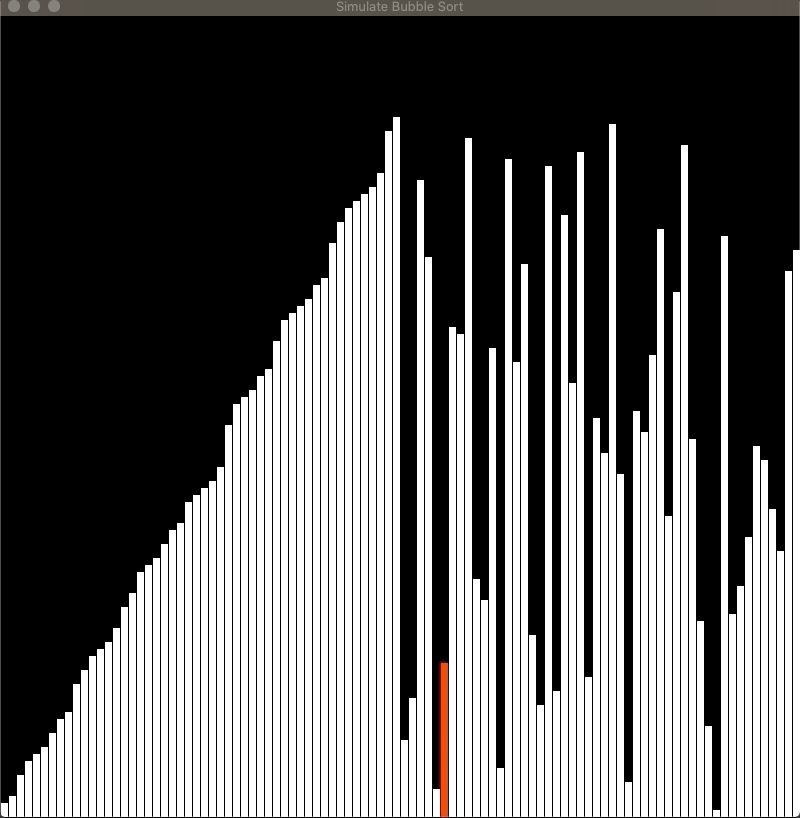

# Sorting-Visualized

## Description
sorting visualization software using java, swing and Runnable.

## Notes

### First Update (Commit 30ce801)
The first commit is with the base requirement,
that is, sorting an array of items (rectangles in this case) in a visualized way.

Right now the only sort available is Bubble sort, but there is an abstract class that 
allows users to create sub Classes (Sorters of their own) called GraphicSorter.
it takes the array and the panel pointer (in order to be able to paint every step)
and also has an optional-use function called "paintPointers" that allows 
users to draw stuff of their own on the panel (using the panel pointer).

for now the design is by no means complete, and I still haven't gave too much thought
on good design for easy and secure additions by users writing extra code on top of that.

I would love if someone can try and contact me, and maybe send a review of my code,
after I'll finish writing comments on the code, in order to be perfectly clear about how each
line works and why each line exists.

Thank you, and enjoy!

#### DEMO

### Second Update (dev branch, Commit d93fac6)
Adding the merge sort, 
I still havn't comment the code properly, 
but I did changed the nasty gray-look of the program.

The jar in the dev branch is yet to be updated, but when I'll merge it(pun intended) to 
the master I will.

In the next working session I'll be working on coloring with Images in the back, and sounds.
The hope is that at the end of the week, the project will also contain a gui and all sort of options
such as inc/decreesing volumn and animation speed, choosing between algorithms and uploading pictures for 
background sorting. all with window/screen management system.

Hopefully, I'll even bring in different-perspective sorting such as puzzle, and more, but that requires 
a design change and I'll have some sort of graphical abstract class that handles the drawing types and actually
draws something on screen.

#### DEMO

### Third Update (dev branch, Commit 2a2d110)
Today I Changed the Stracture of the program, added
the pictures addition and managed to create 2 Helper/Singletone classes for
sound and rendering.

Also I decided to do a class for loading and saving the static image, and 
also cropping it so that the Renderer class could fit the parts of the picture to the rectangles.

Next time I'll probably work on the GUI aspect of the software, described in the second update section  👆🏻

I hope next time I'll also comment and fix design issues and bugs that makes the program
run on way to many resources and makes my computer's fan go crazy.

If somebody is reading this right now, feel free to contact me and maybe suggest some design and 
small things to be fixed.

Thanks!

#### DEMO

